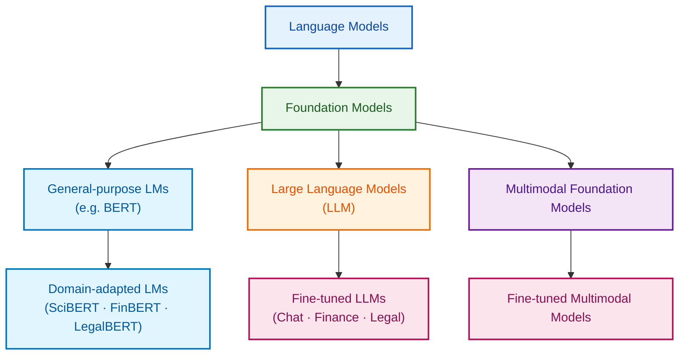

# Introduction

## 10,000 foot view on Language Models



### AI Model Landscape — Executive Summary (One Slide)

| Layer                             | Model Category                   | What It Is (Executive 1-Line)                                    | Representative Examples           | Business Value                                           |
| --------------------------------- | -------------------------------- | ---------------------------------------------------------------- | --------------------------------- | -------------------------------------------------------- |
| **Concept Foundation**            | **Language Models (LM)**         | Models designed to understand and generate human language        | BERT, RoBERTa                     | Core NLP capability (search, classification, extraction) |
| *AI Platform Core*                | *Foundation Models (FM)*         | Large, general-purpose models trained on massive, broad datasets | BERT, LLaMA, Amazon Titan         | Reusable AI base across multiple products and domains    |
| **General NLP Base**              | **General-purpose LMs**          | Foundation language models trained on generic corpora            | BERT                              | Strong baseline NLP understanding                        |
| *Domain Specialization*           | *Domain-adapted LMs*             | General-purpose LMs further trained on domain-specific text      | SciBERT, FinBERT, LegalBERT       | Higher accuracy and explainability in regulated domains  |
| **Scale & Reasoning**             | **Large Language Models (LLM)**  | Very large language foundation models with advanced reasoning    | GPT-4, Claude, Gemini             | Generative AI, reasoning, AI agents                      |
| Behavior / Industry Alignment     | *Fine-tuned LLMs*                | LLMs adapted for specific behaviors or industries                | ChatGPT, Finance LLMs, Legal LLMs | Task precision, compliance, controlled outputs           |
| **Capability Expansion**          | **Multimodal Foundation Models** | Foundation models that handle text, images, audio, and video     | GPT-4o, Gemini, Claude 3          | Rich context understanding and interaction               |
| *End-to-End Solutions*            | *Fine-tuned Multimodal Models*   | Multimodal models customized for concrete business workflows     | Medical AI, Banking OCR AI        | Full workflow automation and decision support            |

## Claude Code Overview

Claude Code is an advanced AI coding assistant designed to

- Transform the way developers **plan**, **write**, **review**, **test**, and **deliver** software.
- Powered by large language models, it understands programming languages from syntax to system architecture and acts as an intelligent development partner rather than a simple code generator.

Claude Code supports

- The entire software development lifecycle—**planning**, **coding**, **testing**, **debugging**, **refactoring**, and **deployment**—by analyzing requirements, generating production-ready code from natural language, creating tests.
- Managing Git workflows directly from the terminal.
- Claude Code helps developers quickly understand new or legacy codebases, dramatically reduces debugging time, and maintains development flow without tool switching.

With features such as

- **Parallel sub-agents**, **checkpoints** for safe refactoring, seamless integration with **Git** platforms, and consistent cross-platform support
- Claude Code enables faster, higher-quality, and more collaborative development.
- Through the **Claude Agent SDK**, teams can also build custom AI agents tailored to their own tools and domains, making Claude Code a strategic partner for **modern** software development.

## Install Claude Code

```bash
npm i -g @anthropic-ai/claude-code
claude -v
```

## Expense Tracker App with Claude Code

```bash
mkdir expense-tracker && cd expense-tracker
claude init
```

```claude
I want to create a simple Python expense tracker application that can:
- Add new expenses with amount, category, and description
- View all expenses
- Calculate total spending
- Save data to a file

Please help me set up the project structure and create the basic files.
```
