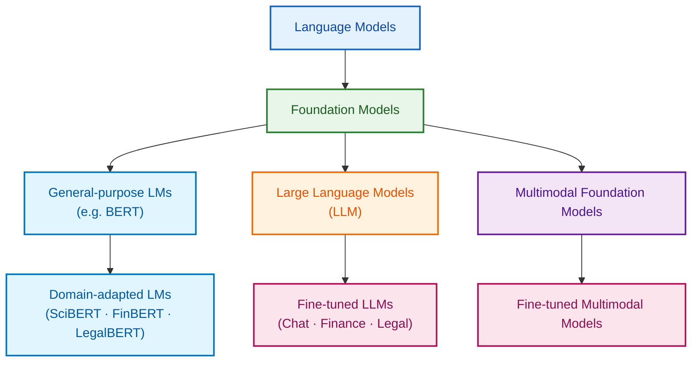

# Introduction

## 10,000 foot view on Language Models



### AI Model Landscape — Executive Summary (One Slide)

| Layer                             | Model Category                   | What It Is (Executive 1-Line)                                    | Representative Examples           | Business Value                                           |
| --------------------------------- | -------------------------------- | ---------------------------------------------------------------- | --------------------------------- | -------------------------------------------------------- |
| **Concept Foundation**            | **Language Models (LM)**         | Models designed to understand and generate human language        | BERT, RoBERTa                     | Core NLP capability (search, classification, extraction) |
| *AI Platform Core*                | *Foundation Models (FM)*         | Large, general-purpose models trained on massive, broad datasets | BERT, LLaMA, Amazon Titan         | Reusable AI base across multiple products and domains    |
| **General NLP Base**              | **General-purpose LMs**          | Foundation language models trained on generic corpora            | BERT                              | Strong baseline NLP understanding                        |
| *Domain Specialization*           | *Domain-adapted LMs*             | General-purpose LMs further trained on domain-specific text      | SciBERT, FinBERT, LegalBERT       | Higher accuracy and explainability in regulated domains  |
| **Scale & Reasoning**             | **Large Language Models (LLM)**  | Very large language foundation models with advanced reasoning    | GPT-4, Claude, Gemini             | Generative AI, reasoning, AI agents                      |
| Behavior / Industry Alignment     | *Fine-tuned LLMs*                | LLMs adapted for specific behaviors or industries                | ChatGPT, Finance LLMs, Legal LLMs | Task precision, compliance, controlled outputs           |
| **Capability Expansion**          | **Multimodal Foundation Models** | Foundation models that handle text, images, audio, and video     | GPT-4o, Gemini, Claude 3          | Rich context understanding and interaction               |
| *End-to-End Solutions*            | *Fine-tuned Multimodal Models*   | Multimodal models customized for concrete business workflows     | Medical AI, Banking OCR AI        | Full workflow automation and decision support            |

## Claude Code Overview

Claude Code is an advanced AI coding assistant designed to

- Transform the way developers **plan**, **write**, **review**, **test**, and **deliver** software.
- Powered by large language models, it understands programming languages from syntax to system architecture and acts as an intelligent development partner rather than a simple code generator.

Claude Code supports

- The entire software development lifecycle—**planning**, **coding**, **testing**, **debugging**, **refactoring**, and **deployment**—by analyzing requirements, generating production-ready code from natural language, creating tests.
- Managing Git workflows directly from the terminal.
- Claude Code helps developers quickly understand new or legacy codebases, dramatically reduces debugging time, and maintains development flow without tool switching.

With features such as

- **Parallel sub-agents**, **checkpoints** for safe refactoring, seamless integration with **Git** platforms, and consistent cross-platform support
- Claude Code enables faster, higher-quality, and more collaborative development.
- Through the **Claude Agent SDK**, teams can also build custom AI agents tailored to their own tools and domains, making Claude Code a strategic partner for **modern** software development.

## Install Claude Code

```bash
npm i -g @anthropic-ai/claude-code
claude -v
```

## Expense Tracker App with Claude Code

```bash
mkdir expense-tracker && cd expense-tracker
claude init
```

```claude
I want to create a simple Python expense tracker application that can:
- Add new expenses with amount, category, and description
- View all expenses
- Calculate total spending
- Save data to a file

Please help me set up the project structure and create the basic files.
```

```bash
pyenv global 3.12.10
pyenv local 3.12.10
python ./expense_tracker.py
python ./test_tracker.py
cat ./expenses.json

cd ..
mkdir -p .claude/commands

```

```cmd
claude
  /review-pr 123 High John

```

## Custom Slash Command & Frontmatter

### Custom Slash Commands

<https://code.claude.com/docs/en/slash-commands#custom-slash-commands>

#### **Syntax**

```note
/<command-name> [arguments]
```

```bash
# Create a personal command
mkdir -p .claude/commands
cat << 'EOF' > .claude/commands/security-review.md
Review this code for security vulnerabilities:
EOF

cat << 'EOF' > .claude/commands/review-pr.md
Print this statement - Review PR #$1 with priority $2 and assign to $3
EOF

cat << 'EOF' > .claude/commands/expense-tracker-doc.md
---
description: Generate and maintain comprehensive documentation from code
argument-hint: --api or --readme
allowed-tools: Bash(ls:*), Bash(cat:*), Bash(test:*), Bash(grep:*), Bash(find:*)
---

Generate and maintain documentation from code, keeping it in sync with implementation.

## Usage Examples

**Basic documentation generation:**
/expense-report-docs

**Generate API documentation:**
/expense-report-docs --api

**Check documentation coverage:**
/expense-report-docs --check

**Generate README:**
/expense-report-docs --readme

**Help and options:**
/expense-report-docs --help

## Implementation

If $ARGUMENTS contains "help" or "--help":
Display this usage information and exit.

Parse documentation options from $ARGUMENTS (--generate, --api, --readme, --check, or specific module/file).

## 1. Analyze Current Documentation

Check existing documentation:
!find . -name "*.md" | grep -v node_modules | head -20
!test -f README.md && echo "README exists" || echo "No README.md found"
!find . -name "*.py" -exec grep -L '"""' {} \; | wc -l

## 2. Generate Documentation

Based on the arguments and project type, generate appropriate documentation.

For Python projects, extract docstrings:
!python -c "import ast; import os; [print(f'{f}: {len([n for n in ast.walk(ast.parse(open(f).read())) if isinstance(n, ast.FunctionDef) and ast.get_docstring(n)])} documented functions') for f in os.listdir('.') if f.endswith('.py')]" 2>/dev/null

## 3. API Documentation

If --api flag is present, analyze API endpoints:
!grep -r -E "@(app|router)\.(get|post|put|delete|patch)" --include="*.py" 2>/dev/null | head -20

## 4. Check Documentation Coverage

Count undocumented functions:
!find . -name "*.py" -exec grep -E "^def |^class " {} \; | wc -l
!find . -name "*.py" -exec grep -A1 -E "^def |^class " {} \; | grep '"""' | wc -l

Think step by step about documentation needs and:

1. Identify what documentation is missing
2. Generate appropriate documentation based on code analysis
3. Create templates for missing documentation
4. Ensure examples are included

Generate documentation in this format:

For README.md:

# Project Name

Brief description of what this project does.

## Installation

```bash
# Installation commands based on package.json or requirements.txt
```

## Usage

```python
# Example usage based on main entry points
```

## API Reference

### [Function/Class Name]

[Description from docstring or inferred from code]

**Parameters**:

- `param_name` (type): Description

**Returns**:

- type: Description

EOF

```

#### **Parameters**

| Parameter        | Description                                                       |
| ---------------- | ----------------------------------------------------------------- |
| `<command-name>` | Name derived from the Markdown filename (without `.md` extension) |
| `[arguments]`    | Optional arguments passed to the command                          |

## SubAgents & Skills

<https://code.claude.com/docs/en/sub-agents>
<https://code.claude.com/docs/en/skills>
