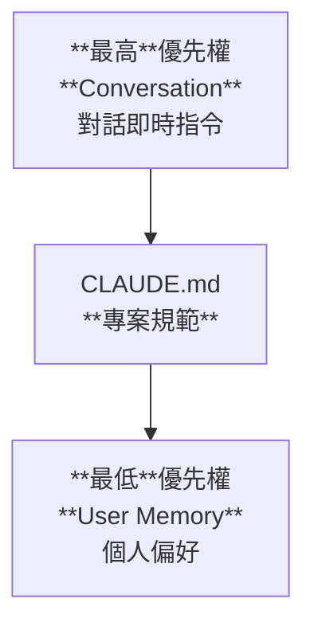

# Claude Code Memory - Hands On

## 🧠 當「使用者記憶（User Memory）」具有優先權時

使用者層級的記憶(MEMORY TYPES)在以下情況下會具有優先權：

### 1️⃣ CLAUDE.md 未涵蓋的內容

當專案記憶（CLAUDE.md）沒有定義相關規則時，系統會使用你的個人偏好來補足空白。

### 2️⃣ 你在對話中明確覆寫

如果你在對話中明確指示：

> 「忽略專案設定，使用我的偏好」

那麼使用者記憶會覆蓋專案設定。

### 3️⃣ 個人工作流程偏好

包含你偏好的：

* 資訊呈現方式
* 溝通風格
* 工作習慣

## ✅ 最佳實踐（Best Practice）

可以這樣理解記憶的優先順序：

### 👤 User Memory（使用者記憶）

➡ 你的個人預設與偏好設定

### 📄 CLAUDE.md（專案記憶）

➡ 不可妥協的專案標準，會覆蓋你的個人預設

### 💬 Conversation（即時對話）

➡ 即時上下文，優先權最高，可覆蓋所有設定

## 📊 優先順序總結



## 🎯 總結優先權順序

最高優先 ↑

1. Conversation（即時對話）
2. IDE Selection（選取內容）
3. Project CLAUDE.md（專案規範）
4. User Memory（個人偏好）
5. System Defaults（系統預設）

最低優先 ↓

## Hands-On 練習

RESOURCES: <https://github.com/firstlink/claude-code/blob/main/claude-code-memory/README.md>

```bash
mkdir -p memory-hands-on && cd memory-hands-on

cat << 'EOF' > README.md
# Personal Finance Tracker CLI

A command-line application for tracking personal finances built.

## Overview

This CLI application helps you manage your personal finances by tracking transactions with categories, amounts, and descriptions.


#### 1. Add Transaction (`add`)

Add a new financial transaction to your tracker.

**Required Options:**
- `--amount` (float): The transaction amount
- `--category` (string): The transaction category (e.g., groceries, utilities, entertainment)

**Optional Options:**
- `--description` (string): Additional details about the transaction

**Functionality:**
- Creates a transaction dictionary containing:
  - amount
  - category
  - description
  - date
- Displays the added transaction to the user

**Usage Example:**
```bash
EOF

```

```bash
claude

/init

Refer to the README.md to implement the Personal Finance Tracker CLI application.
```

```cmd
cd memory-hands-on
pyenv global 3.12.10
pyenv local 3.12.10
python finance_tracker.py add --amount 100.12 --category foods --description "Grocery shopping"
```

## Project with User Memory

```bash
cat << 'EOF' > ~/.claude/CLAUDE.md
# My Personal Python Preferences

## Code Style

- Use Black formatter with 88 character line length
- Use isort for import sorting
- Type hints required for all functions
- Use pathlib instead of os.path

## CLI Development with Click

- Use click.group() for command organization
- Always include help text with """docstrings"""
- Use click.option() for optional flags
- Use click.argument() for required positional args

## Decimal for Money

Always use Decimal for financial calculations, never float:

```python
from decimal import import Decimal

# Correct
amount = Decimal('10.50')

# Wrong - floating point errors
amount = float(10.50)
```

## Testing

- Use pytest for all tests
- Test files: test_*.py
- Run with: pytest -v

## Common Commands

```bash
# Format code
black . && isort .

# Run tests
pytest -v

# Type check
mypy src/
```
EOF
```

```bash
claude
/clear

Use the user memory to update the python code in this directory and test it. 
/clear

I do NO see python test files. You missed testing coverage as part of user memory. Fix it.
/clear
/auto-commit

Update the project README.md in this directory.
/clear
/auto-commit


Generate requirements.txt for this project and update CLAUDE.md and README.md accordingly.
/clear
/auto-commit

```

```cmd
pytest test_finance_tracker.py -v
```
