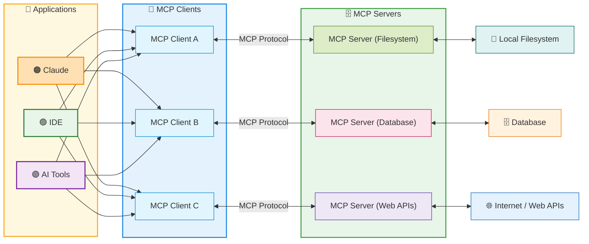

# All about MCP

## MCP – Architecture Components

1) MCP Client  
    Applications like Tempo, WindSurf, and FirstServe serving as the LLM-facing interface.

2) MCP Protocol  
    Standardized communication layer enabling two-way connections between clients and servers.

3) MCP Server  
    Component translating external services and capabilities into a format the client can understand.

MCP creates a standardized ecosystem that enables LLMs to interact with external services through a unified interface.

### MCP – Complete Architecture

The Model Context Protocol creates a standardized ecosystem that enables LLMs to discover and utilize external capabilities consistently across different implementations.



Benefits: MCP eliminates the need for custom integrations between each LLM and external service, significantly reducing **complexity** while improving scalability and innovation.

## Server Key Components

1. MODEL CONTROLLED - Tools - Functions invoked by the model

Model-controlled functions that enable the AI to take actions like retrieving data, sending messages, or updating database records.

- Retrieve / search
- Send a message
- Update DB records

1. APPLICATION-CONTROLLED - Resources - Data exposed to the application

User-controlled templates that standardize AI interactions for specific use cases like document Q&A, transcript summaries, and workflow automation.

- Files
- Database Records
- API Responses

1. USER CONTROLLED - Prompts - Pre-defined templates for AI interactions

MCP Server acts as the resource provider, with capabilities that include Resources, Tools, Context, Prompts.

- Document Q&A
- Transcript Summary
- Workflow Automation

## MCP – Transport Types

Stdio Transport - Local Transport

- Uses standard input/output streams
- Ideal for local process communication
- Used in command-line tools and integrations
- Limited to same-machine

HTTP with SSE - Original Remote Transport

- Server-Sent Events for server → client streaming
- HTTP POST for client → server messages
- Enabled remote MCP servers
- Requires maintaining constant connection state

**Streamable** HTTP - Released March 2025

- Enables stateless server architecture
- No requirement for long-term connections
- More flexible for cloud and serverless deployment
- Ideal for modern web architecture

## MCP Flow Example - Excel Document Analyzer

### Claude Desktop Application

0. On start-up, server capabilities are sent to the client.
1. User makes remapping request to Claude.
2. Claude looks at analysis tools and plans how to achieve the user's request.

### MCP Server Code

1. Claude calls one tool at a time; outputs affect next tool calls.

    Server

    1. Tools:

        - Validate Document
        - Extract Data
        - Analyze Data
        - Generate Report
        - Save Report

    2. Prompts:

        - Analyze Data

2. Tools allow Claude access to files needed for analysis.

    File System:

    - Excel Document
    - Excel Document
    - New file

## MCP Servers Walkthrough

RESOURCES: <https://github.com/christseng89/claude-code/tree/main/claude-code-mcp-server>

### Top 10 Essential MCP Server for Claude Code

<https://apidog.com/blog/top-10-mcp-servers-for-claude-code/>

- Github 簡化版本控制
- ApiDog 將 AI 連接到 API 規範
- File System 管理本機文件
- Sequential Thinking 增強問題解決能力
- Puppeteer 自動化 Web 交互
- PostgreSQL 自然地查詢資料庫
- Notion 提升生產力
- Memory Bank 保留上下文
- Figma 設計到程式碼工作流程
- Zapier 自動化跨應用程式工作流程

## MCP Server with Puppeteer

<https://github.com/merajmehrabi/puppeteer-mcp-server>

```bash
npm install -g puppeteer-mcp-server
npx puppeteer-mcp-server
```

```bash
claude
claude mcp add puppeteer-mcp-server --scope project

quit

claude
/mcp

puppeteer-mcp-server · ✘ failed, fix it
quit

claude
/mcp

   puppeteer-mcp-server · ✔ connected  
   weather · ✔ connected

Can you scrape www.google.com and summarize it. Please use puppeteer for the web scraping
   # Especially useful for Local Web Apps that require JavaScript rendering.

/clear
/auto-commit   
```

## MCP Server with Sequential Thinking

<https://github.com/modelcontextprotocol/servers/tree/main/src/sequentialthinking>

### Overview

The Sequential Thinking MCP server provides a structured, step-by-step thinking process for dynamic and reflective problem-solving. It enables breaking down complex problems into manageable steps with capacity for revision and exploring alternative reasoning paths.

### Features

- **Break down complex problems** into manageable steps
- **Revise and refine thoughts** as understanding deepens
- **Branch into alternative paths** of reasoning
- **Track thought progression** with indexing (thoughtNumber, totalThoughts)
- **Adjust dynamically** the total number of thoughts as analysis progresses
- **Generate and verify** solution hypotheses iteratively
- **Maintain context** over multiple reasoning steps

### Tool: sequential_thinking

The server provides a single tool called `sequential_thinking` that facilitates detailed thinking processes.

**Parameters:**

- `thought` (string) - The content of the current thinking step
- `nextThoughtNeeded` (boolean) - Whether another thought step is needed
- `thoughtNumber` (integer) - The index of the current thought
- `totalThoughts` (integer) - The model's current estimate of total steps
- `isRevision` (boolean, optional) - Marks this thought as a revision
- `revisesThought` (integer, optional) - Specifies which thought number is being revised
- `branchFromThought` (integer, optional) - Specifies the thought to branch from
- `branchId` (string, optional) - An identifier for a specific reasoning branch

### Common Use Cases

- **Complex problem decomposition** - Breaking architectural decisions into steps
- **Planning with course correction** - Iterative refinement of strategies
- **Exploratory reasoning** - Testing multiple approaches in parallel branches
- **Debugging and root cause analysis** - Systematic investigation of issues
- **Algorithm design** - Step-by-step logic development with verification

### Installation

```bash
claude
claude mcp add sequential-thinking --scope project -- npx -y @modelcontextprotocol/server-sequential-thinking

quit

claude
/mcp

   s quential-thinking · ◯ connecting…. Hangs on fix it.

quit
claude
/mcp

   sequential-thinking · ✔ connected

/clear
/auto-commit      
```

### Configuration

**Optional Environment Variable:**

- `DISABLE_THOUGHT_LOGGING=true` - Disable logging of thought information

### Example Usage

After installation and restart, you can use the sequential_thinking tool:

```python
# Example 1: Initial problem breakdown
sequential_thinking({
    "thought": "Need to optimize database queries for the expense tracker API",
    "thoughtNumber": 1,
    "totalThoughts": 5,
    "nextThoughtNeeded": True
})

# Example 2: Revising a previous thought
sequential_thinking({
    "thought": "Actually, indexing on user_id and date columns would be most effective",
    "thoughtNumber": 3,
    "totalThoughts": 5,
    "isRevision": True,
    "revisesThought": 2,
    "nextThoughtNeeded": True
})

# Example 3: Exploring alternative approach
sequential_thinking({
    "thought": "Alternative: Use query result caching instead of database optimization",
    "thoughtNumber": 4,
    "totalThoughts": 6,
    "branchFromThought": 2,
    "branchId": "caching-approach",
    "nextThoughtNeeded": True
})
```

### Benefits

- Structures AI reasoning into clear, traceable steps
- Enables iterative refinement without losing context
- Supports exploring multiple solution paths
- Improves problem-solving for complex scenarios
- Makes the AI's thought process transparent and auditable
