# All about MCP

## MCP – Architecture Components

1) MCP Client  
    Applications like Tempo, WindSurf, and FirstServe serving as the LLM-facing interface.

2) MCP Protocol  
    Standardized communication layer enabling two-way connections between clients and servers.

3) MCP Server  
    Component translating external services and capabilities into a format the client can understand.

MCP creates a standardized ecosystem that enables LLMs to interact with external services through a unified interface.

### MCP – Complete Architecture

The Model Context Protocol creates a standardized ecosystem that enables LLMs to discover and utilize external capabilities consistently across different implementations.

```mermaid
flowchart LR
    %% ======================
    %% MCP – Complete Architecture (Revised)
    %% ======================

    %% --- Applications Layer ---
    subgraph APPS["🧩 Applications"]
        Claude["🟠 Claude"]
        IDE["🟢 IDE"]
        AI["🟣 AI Tools"]
    end

    %% --- MCP Clients Layer ---
    subgraph CLIENTS["🔌 MCP Clients"]
        MCPClient1["MCP Client A"]
        MCPClient2["MCP Client B"]
        MCPClient3["MCP Client C"]
    end

    %% --- MCP Servers Layer ---
    subgraph SERVERS["🗄️ MCP Servers"]
        ServerFS["MCP Server (Filesystem)"]
        ServerDB["MCP Server (Database)"]
        ServerWEB["MCP Server (Web APIs)"]
    end

    %% --- External Resources ---
    FS["📁 Local Filesystem"]
    DB["🗄️ Database"]
    WEB["🌐 Internet / Web APIs"]

    %% ======================
    %% Connections
    %% ======================

    %% Applications → Any MCP Client
    Claude --> MCPClient1
    Claude --> MCPClient2
    Claude --> MCPClient3

    IDE --> MCPClient1
    IDE --> MCPClient2
    IDE --> MCPClient3

    AI --> MCPClient1
    AI --> MCPClient2
    AI --> MCPClient3

    %% MCP Clients ↔ MCP Servers
    MCPClient1 <--> |MCP Protocol| ServerFS
    MCPClient2 <--> |MCP Protocol| ServerDB
    MCPClient3 <--> |MCP Protocol| ServerWEB

    %% MCP Servers ↔ External Systems
    ServerFS <--> FS
    ServerDB <--> DB
    ServerWEB <--> WEB

    %% ======================
    %% Styling
    %% ======================
    style APPS fill:#FFF8E1,stroke:#F9A825,stroke-width:2px
    style CLIENTS fill:#E3F2FD,stroke:#1E88E5,stroke-width:2px
    style SERVERS fill:#E8F5E9,stroke:#43A047,stroke-width:2px

    style Claude fill:#FFE0B2,stroke:#FB8C00,stroke-width:2px
    style IDE fill:#E8F5E9,stroke:#2E7D32,stroke-width:2px
    style AI fill:#F3E5F5,stroke:#7B1FA2,stroke-width:2px

    style MCPClient1 fill:#E1F5FE,stroke:#0288D1
    style MCPClient2 fill:#E1F5FE,stroke:#0288D1
    style MCPClient3 fill:#E1F5FE,stroke:#0288D1

    style ServerFS fill:#DCEDC8,stroke:#558B2F
    style ServerDB fill:#FCE4EC,stroke:#C2185B
    style ServerWEB fill:#EDE7F6,stroke:#5E35B1

    style FS fill:#E0F2F1,stroke:#00695C
    style DB fill:#FFF3E0,stroke:#EF6C00
    style WEB fill:#E3F2FD,stroke:#1565C0

```



Benefits: MCP eliminates the need for custom integrations between each LLM and external service, significantly reducing **complexity** while improving scalability and innovation.

## Server Key Components

1. MODEL CONTROLLED - Tools - Functions invoked by the model

Model-controlled functions that enable the AI to take actions like retrieving data, sending messages, or updating database records.

- Retrieve / search
- Send a message
- Update DB records

1. APPLICATION-CONTROLLED - Resources - Data exposed to the application

User-controlled templates that standardize AI interactions for specific use cases like document Q&A, transcript summaries, and workflow automation.

- Files
- Database Records
- API Responses

1. USER CONTROLLED - Prompts - Pre-defined templates for AI interactions

MCP Server acts as the resource provider, with capabilities that include Resources, Tools, Context, Prompts.

- Document Q&A
- Transcript Summary
- Workflow Automation

## MCP – Transport Types

Stdio Transport - Local Transport

- Uses standard input/output streams
- Ideal for local process communication
- Used in command-line tools and integrations
- Limited to same-machine

HTTP with SSE - Original Remote Transport

- Server-Sent Events for server → client streaming
- HTTP POST for client → server messages
- Enabled remote MCP servers
- Requires maintaining constant connection state

**Streamable** HTTP - Released March 2025

- Enables stateless server architecture
- No requirement for long-term connections
- More flexible for cloud and serverless deployment
- Ideal for modern web architecture

## MCP Flow Example - Excel Document Analyzer

### Claude Desktop Application

0. On start-up, server capabilities are sent to the client.
1. User makes remapping request to Claude.
2. Claude looks at analysis tools and plans how to achieve the user's request.

### MCP Server Code

1. Claude calls one tool at a time; outputs affect next tool calls.

    Server

    1. Tools:

        - Validate Document
        - Extract Data
        - Analyze Data
        - Generate Report
        - Save Report

    2. Prompts:

        - Analyze Data

2. Tools allow Claude access to files needed for analysis.

    File System:

    - Excel Document
    - Excel Document
    - New file

## MCP Servers Walkthrough

RESOURCES: <https://github.com/christseng89/claude-code/tree/main/claude-code-mcp-server>

### Top 10 Essential MCP Server for Claude Code

<https://apidog.com/blog/top-10-mcp-servers-for-claude-code/>

- Github 簡化版本控制
- ApiDog 將 AI 連接到 API 規範
- File System 管理本機文件
- Sequential Thinking 增強問題解決能力
- Puppeteer 自動化 Web 交互
- PostgreSQL 自然地查詢資料庫
- Notion 提升生產力
- Memory Bank 保留上下文
- Figma 設計到程式碼工作流程
- Zapier 自動化跨應用程式工作流程

## MCP Server with Puppeteer

<https://github.com/merajmehrabi/puppeteer-mcp-server>

```bash
npm install -g puppeteer-mcp-server
npx puppeteer-mcp-server
```

```bash
claude
claude mcp add puppeteer-mcp-server --scope project

quit

claude
/mcp

puppeteer-mcp-server · ✘ failed, fix it
quit

claude
/mcp

   puppeteer-mcp-server · ✔ connected  
   weather · ✔ connected

Can you scrape www.google.com and summarize it. Please use puppeteer for the web scraping
   # Especially useful for Local Web Apps that require JavaScript rendering.

/clear
/auto-commit   
```
