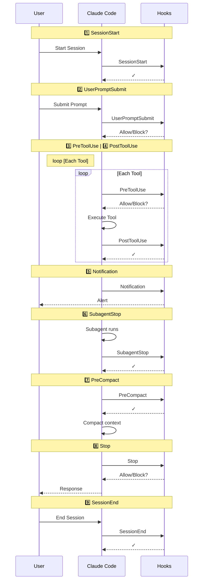

# Hooks

## Hooks - Introduction to Claude Code Hooks

Understanding Claude Code Hooks

Claude Code Hooks are user-defined **shell scripts** that execute automatically at **specific points** during Claude Code’s **operation lifecycle**. They act as ***event triggers*** that let you **automate workflows**, **enforce policies**, and **integrate external tools—ensuring** certain actions always happen rather than relying on the AI to choose to run them.

- Execute Commands
    Custom commands at **predefined lifecycle events**
- Control Actions
    Approve, block, or modify Claude’s decisions
- Local Scripts
    Run as **shell scripts** (.sh files) with JSON input
- Flexible Config
    **User-level** and **project-level** configuration options

### Claude Hook Complete Flow

### ✅ Hooks 触发点一览表

| # | Hook 名称        | 触发时机              | 是否可阻止 | 使用场景                |
| - | ---------------- | --------------------- | ---------- | ------------------- |
| 1 | SessionStart     | 会话开始 / 恢复       | 否      | 加载开发上下文，展示项目信息      |
| 2 | UserPromptSubmit | 用户提交提示词           | ✅ 是   | 校验 / 修改提示词，注入上下文    |
| 3 | PreToolUse       | 工具调用之前            | ✅ 是   | 校验或预批准工具使用，阻止危险命令   |
| 4 | PostToolUse      | 工具执行完成后           | 否     | 自动格式化代码、运行测试、记录操作日志 |
| 5 | Notification     | Claude 需要权限 / 空闲时 | 否     | 自定义通知处理、告警          |
| 6 | SubagentStop     | 子代理执行结束           | 否     | 子代理专属的后处理逻辑         |
| 7 | PreCompact       | 压缩上下文前            | 否     | 在压缩前备份对话、准备压缩数据     |
| 8 | Stop             | 主代理执行完成           | 否     | 清理状态、最终处理           |
| 9 | SessionEnd       | 会话结束              | 否     | 清理资源、记录会话统计信息       |

- ✅ UserPromptSubmit：是做 Prompt 安全与上下文治理的第一道关
- ✅ PreToolUse：是做工具级权限控制与风险阻断的关键节点

## Hooks 被触发时 & 真实世界使用场景**

→ **执行前校验（Pre-execution validation）**
用于安全扫描与策略执行（Security scanning and policy enforcement）

→ **执行后集成（Post-execution integration）**
用于日志记录、通知以及外部系统更新（Logging, notifications, and external system updates）

→ **审批工作流（Approval workflows）**
针对敏感操作设置人工审核关卡（Human review gates for sensitive operations）

---

### 🎯 放到你熟悉的企业 / 银行业 Agent 架构中，可对应为

| Hook              | 实际用途             |
| ----------------- | ---------------- |
| UserPromptSubmit  | 合规条款注入、客户身份上下文补充 |
| PreToolUse        | 禁止越权交易、阻止高风险API  |
| PostToolUse       | 审计日志、风控同步        |
| Approval Workflow | 高风险操作走人工审批       |

这正是 **AI Agent 治理层（Governance Layer）** 的核心设计模式。

---
