# Hooks

## Hooks - Introduction to Claude Code Hooks

Understanding Claude Code Hooks

Claude Code Hooks are user-defined **shell scripts** that execute automatically at **specific points** during Claude Code’s **operation lifecycle**. They act as ***event triggers*** that let you **automate workflows**, **enforce policies**, and **integrate external tools—ensuring** certain actions always happen rather than relying on the AI to choose to run them.

- Execute Commands
    Custom commands at **predefined lifecycle events**
- Control Actions
    Approve, block, or modify Claude’s decisions
- Local Scripts
    Run as **shell scripts** (.sh files) with JSON input
- Flexible Config
    **User-level** and **project-level** configuration options

### Claude Hook Complete Flow

```mermaid
sequenceDiagram
    participant User
    participant Claude Code
    participant Hooks
    
    Note over User,Hooks: 1️⃣ SessionStart
    User->>Claude Code: Start Session
    Claude Code->>Hooks: SessionStart
    Hooks-->>Claude Code: ✓
    
    Note over User,Hooks: 2️⃣ UserPromptSubmit
    User->>Claude Code: Submit Prompt
    Claude Code->>Hooks: UserPromptSubmit
    Hooks-->>Claude Code: Allow/Block?
    
    Note over User,Hooks: 3️⃣ PreToolUse | 4️⃣ PostToolUse
    Note left of Claude Code: loop [Each Tool]
    loop Each Tool
        Claude Code->>Hooks: PreToolUse
        Hooks-->>Claude Code: Allow/Block?
        Claude Code->>Claude Code: Execute Tool
        Claude Code->>Hooks: PostToolUse
        Hooks-->>Claude Code: ✓
    end
    
    Note over User,Hooks: 5️⃣ Notification
    Claude Code->>Hooks: Notification
    Hooks-->>User: Alert

    Note over User,Hooks: 6️⃣ SubagentStop
    Claude Code->>Claude Code: Subagent runs
    Claude Code->>Hooks: SubagentStop
    Hooks-->>Claude Code: ✓

    Note over User,Hooks: 7️⃣ PreCompact
    Claude Code->>Hooks: PreCompact
    Hooks-->>Claude Code: ✓
    Claude Code->>Claude Code: Compact context

    Note over User,Hooks: 8️⃣ Stop
    Claude Code->>Hooks: Stop
    Hooks-->>Claude Code: Allow/Block?
    Claude Code-->>User: Response

    Note over User,Hooks: 9️⃣ SessionEnd
    User->>Claude Code: End Session
    Claude Code->>Hooks: SessionEnd
    Hooks-->>Claude Code: ✓
```



### ✅ Hooks 触发点一览表

| # | Hook 名称        | 触发时机              | 是否可阻止 | 使用场景                |
| - | ---------------- | --------------------- | ---------- | ------------------- |
| 1 | SessionStart     | 会话开始 / 恢复       | 否      | 加载开发上下文，展示项目信息      |
| 2 | UserPromptSubmit | 用户提交提示词           | ✅ 是   | 校验 / 修改提示词，注入上下文    |
| 3 | PreToolUse       | 工具调用之前            | ✅ 是   | 校验或预批准工具使用，阻止危险命令   |
| 4 | PostToolUse      | 工具执行完成后           | 否     | 自动格式化代码、运行测试、记录操作日志 |
| 5 | Notification     | Claude 需要权限 / 空闲时 | 否     | 自定义通知处理、告警          |
| 6 | SubagentStop     | 子代理执行结束           | 否     | 子代理专属的后处理逻辑         |
| 7 | PreCompact       | 压缩上下文前            | 否     | 在压缩前备份对话、准备压缩数据     |
| 8 | Stop             | 主代理执行完成           | 否     | 清理状态、最终处理           |
| 9 | SessionEnd       | 会话结束              | 否     | 清理资源、记录会话统计信息       |

- ✅ UserPromptSubmit：是做 Prompt 安全与上下文治理的第一道关
- ✅ PreToolUse：是做工具级权限控制与风险阻断的关键节点

## Hooks 被触发时 & 真实世界使用场景**

→ **执行前校验（Pre-execution validation）**
用于安全扫描与策略执行（Security scanning and policy enforcement）

→ **执行后集成（Post-execution integration）**
用于日志记录、通知以及外部系统更新（Logging, notifications, and external system updates）

→ **审批工作流（Approval workflows）**
针对敏感操作设置人工审核关卡（Human review gates for sensitive operations）

---

### 🎯 放到你熟悉的企业 / 银行业 Agent 架构中，可对应为

| Hook              | 实际用途             |
| ----------------- | ---------------- |
| UserPromptSubmit  | 合规条款注入、客户身份上下文补充 |
| PreToolUse        | 禁止越权交易、阻止高风险API  |
| PostToolUse       | 审计日志、风控同步        |
| Approval Workflow | 高风险操作走人工审批       |

这正是 **AI Agent 治理层（Governance Layer）** 的核心设计模式。

---

## Hooks - Format a Typescript

```bash
mkdir -p demo/hooks

cat << 'EOF' > demo/hooks/demo.ts
const user={name:"John Doe",age:30,email:"john@example.com"};function processUser(userData:any){if(userData.name&&userData.age){console.log(`Processing user: ${userData.name}`);return{...userData,processed:true,timestamp:Date.now(),};}else{throw new Error("Invalid user data");}}const result=processUser(user);console.log(result);
EOF
```

```bash
claude
Add a comment at the beginning of demo.ts in demo/hooks.
```

```bash
mkdir -p ~/.claude/scripts
cat << 'EOF' > ~/.claude/scripts/format-typescript.sh
#!/bin/bash
# TypeScript formatting hook script

# Read JSON input from Claude Code
input_json=$(cat)

# Extract file path from the JSON input using jq
file_path=$(echo "$input_json" | jq -r '.tool_input.file_path // empty')

# Check if we got a valid file path
if [[ -z "$file_path" ]]; then
  exit 0
fi

# Check if the file is a TypeScript file
if [[ "$file_path" =~ \.(ts|tsx)$ ]]; then
  # Check if prettier is installed
  if ! command -v prettier &> /dev/null; then
    echo "Warning: prettier is not installed. Install with: npm install -g prettier" >&2
    exit 1
  fi

  # Check if file exists
  if [[ ! -f "$file_path" ]]; then
    echo "Warning: File $file_path does not exist" >&2
    exit 1
  fi

  # Run prettier on the TypeScript file
  if prettier --write "$file_path" 2>/dev/null; then
    echo "✅ Formatted TypeScript file: $file_path"
    exit 0
  else
    echo "❌ Error: Failed to format $file_path with prettier" >&2
    exit 1
  fi
else
  # Not a TypeScript file, just exit successfully
  exit 0
fi
EOF

chmod +x ~/.claude/scripts/format-typescript.sh
```

```bash
claude
/hooks
    2.  PostToolUse - After tool execution 
    1. + Add new matcher… 
        Write|Edit|MultiEdit  

    1. + Add new hook…
        ~/.claude/scripts/format-typescript.sh

    2. User settings          Checked in at ~\.claude\settings.json

Add a log at the end of the file demo.ts in the demo\hooks directory
```
