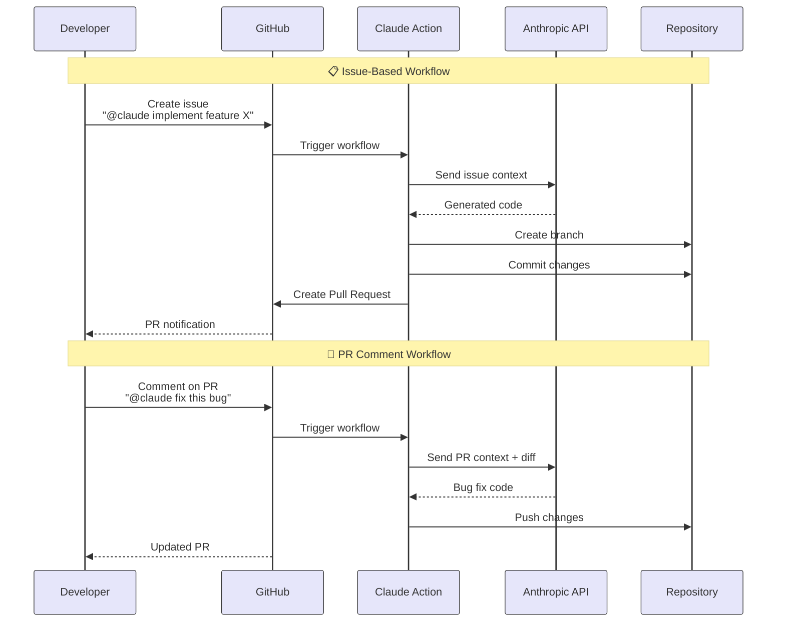

#  

## Introduction to Claude Code GitHub Actions

AI-powered automation integrated directly into your GitHub workflow (不再只是你本地用 Claude 改代码，而是：在 PR、Issue、CI 流程中，Claude 可以自动改代码、提 PR、跑修复。)

- Simple Mentions
Trigger with @claude in issues and PRs (在 Issue 或 PR 里 @claude 就能触发 AI 交互, '**@claude** please refactor this function')
  - Claude 自动：
    - 修改代码
    - 提交新 commit
    - 更新 PR

- Cloud Native
Runs on GitHub's secure infrastructure

  - 👉 在 GitHub 官方安全云环境中运行
    - 不需要你部署服务器
    - 不跑在开发者电脑
    - 符合企业安全合规
  - 👉 符合 SOC2 / 内控审计

- Smart Integration
Follows your project's coding standards automatically

  - 👉 自动遵循项目编码规范
  - Claude 不会随便写代码，而是：
    - 读取项目里的：
      - ESLint
      - Prettier
      - tsconfig.json
      - 单元测试
    - 按你项目风格写代码

- Full Automation
Code implementation and PR creation out of the box

  - 👉 自动写代码 + 自动创建 PR
  - 不只是建议你怎么改，而是：
    - 直接改好代码 → 提交 → 建 PR → 等你审核

## Workflow in Actions



1. Mention @claude  
Describe the task in an issue or pull request

2. Action Triggers  
GitHub workflow runs automatically

3. Claude Executes  
Generates code or review based on context

4. PR (pull request) Created  
Changes appear as pull request for review

**Pull Request (PR)** = A **proposal/request** to merge **a branch** into the **main branch**

### The Flow

1. **Create branch** → Developer makes changes in a separate branch
2. **Create Pull Request** → Developer proposes: "Hey, I want to merge my changes into main"
3. **Code Review** → Team reviews the PR, discusses, requests changes
4. **Approval** → Reviewers approve the PR
5. **Merge PR** → Someone clicks "Merge" button, and the branch is finally merged into main

In the diagram

- "Create Pull Request" = Opens the PR for **review**
- The PR might stay open for **review** before being **merged**
- Only after **approval** would someone **merge** it into the **main branch**

## Integrate Claude Code with GitHub Actions

```bash
claude
/install-github-app
    > Use current repository: christseng89/ClaudeMastery
    Press Enter once you've installed the app…  
      ✓ @Claude Code  
        Tag @claude in issues and PR comments  

      ✓ Claude Code Review                                                                                          
        Automated code review on new PRs                                                                             
     
      Press Enter to continue...

      Install GitHub App                                                                                               
      Success                                                                                                                                                                                                                   
      ✓ GitHub Actions workflow created!                   
      ✓ API key saved as ANTHROPIC_API_KEY secret 
```

```bash
git pull
```

## Claude Code - Pull Request Workflow Explanation

```bash
cat << 'EOF' > .github/workflows/bug-fix.yml
# 在 GitHub 仓库中给一个问题（Issue）打上“bug”标签时，
# 会自动启动 Claude AI 来分析代码、修复错误并提交代码拉取请求（PR）。
name: Claude Bug Fix Automation

on:
  issues:
    types: [labeled]

jobs:
  auto-fix-bug:
    # Only run when issue is labeled with 'bug'
    if: github.event.label.name == 'bug'
    runs-on: ubuntu-latest
    permissions:
      contents: write # To create branches and commits
      pull-requests: write # To create PRs
      issues: write # To comment on issues
      id-token: write #
      actions: read #

    timeout-minutes: 10

    steps:
      - name: Checkout repository
        uses: actions/checkout@v5
        with:
          fetch-depth: 0

      - name: Run Claude to fix the bug
        uses: anthropics/claude-code-action@v1
        with:
          claude_code_oauth_token: ${{ secrets.CLAUDE_CODE_OAUTH_TOKEN }}
          track_progress: true
          prompt: |
            REPO: ${{ github.repository }}
            ISSUE NUMBER: ${{ github.event.issue.number }}

            Your task is to automatically fix the bug described in the issue above:

            1. Read and analyze the issue to understand what needs to be fixed
            2. Locate and read the affected files
            3. Fix ALL bugs and security issues you identify
            4. Create a new branch for your fixes using git
            5. Commit your changes with a clear commit message
            6. Push the branch to origin
            7. Create a pull request using `gh pr create` with your Bash tool
            8. Comment on the original issue with the PR link using `gh issue comment`
          claude_args: |
            --model claude-sonnet-4-5-20250929
            --max-turns 10
            --allowed-tools "Read,Edit,Write,Glob,Grep,Bash(git:*),Bash(npm:*),Bash(npx:*),Bash(gh:*)"
EOF
```

```bash
cat << 'EOF' > demo/hooks/userManager.ts
// User Management System

interface User {
  id: number;
  username: string;
  password: string;
  email: string;
}

class UserManager {
  private users: User[] = [];

  authenticateUser(username: string, password: string): boolean {
    const query = `SELECT * FROM users WHERE username = '${username}' AND password = '${password}'`;
    console.log("Executing query:", query);
    return true;
  }

  createUser(username: string, password: string, email: string): User {
    const user: User = {
      id: this.users.length + 1,
      username: username,
      password: password,
      email: email,
    };
    this.users.push(user);
    return user;
  }

  findUserById(id: any): User | undefined {
    return this.users.find((user) => user.id == id);
  }
}

export default UserManager;
EOF
```

```bash
claude
/auto-commit
/clear
```
