#  

## Introduction to Claude Code GitHub Actions

AI-powered automation integrated directly into your GitHub workflow (不再只是你本地用 Claude 改代码，而是：在 PR、Issue、CI 流程中，Claude 可以自动改代码、提 PR、跑修复。)

- Simple Mentions
Trigger with @claude in issues and PRs (在 Issue 或 PR 里 @claude 就能触发 AI 交互, '**@claude** please refactor this function')
  - Claude 自动：
    - 修改代码
    - 提交新 commit
    - 更新 PR

- Cloud Native
Runs on GitHub's secure infrastructure

  - 👉 在 GitHub 官方安全云环境中运行
    - 不需要你部署服务器
    - 不跑在开发者电脑
    - 符合企业安全合规
  - 👉 符合 SOC2 / 内控审计

- Smart Integration
Follows your project's coding standards automatically

  - 👉 自动遵循项目编码规范
  - Claude 不会随便写代码，而是：
    - 读取项目里的：
      - ESLint
      - Prettier
      - tsconfig.json
      - 单元测试
    - 按你项目风格写代码

- Full Automation
Code implementation and PR creation out of the box

  - 👉 自动写代码 + 自动创建 PR
  - 不只是建议你怎么改，而是：
    - 直接改好代码 → 提交 → 建 PR → 等你审核

## Workflow in Actions

```mermaid
%%{init: {'theme':'base', 'themeVariables': { 'primaryColor':'#E6E6FA','lineColor':'#666','primaryBorderColor':'#333'}}}%%

sequenceDiagram
    participant Developer
    participant GitHub
    participant Claude Action
    participant Anthropic API
    participant Repository
    
    Note over Developer,Repository: 📋 Issue-Based Workflow
    Developer->>GitHub: Create issue<br/>"@claude implement feature X"
    GitHub->>Claude Action: Trigger workflow
    Claude Action->>Anthropic API: Send issue context
    Anthropic API-->>Claude Action: Generated code
    Claude Action->>Repository: Create branch
    Claude Action->>Repository: Commit changes
    Claude Action->>GitHub: Create Pull Request
    GitHub-->>Developer: PR notification
    
    Note over Developer,Repository: 💬 PR Comment Workflow
    Developer->>GitHub: Comment on PR<br/>"@claude fix this bug"
    GitHub->>Claude Action: Trigger workflow
    Claude Action->>Anthropic API: Send PR context + diff
    Anthropic API-->>Claude Action: Bug fix code
    Claude Action->>Repository: Push changes
    GitHub-->>Developer: Updated PR
```



1. Mention @claude  
Describe the task in an issue or pull request

2. Action Triggers  
GitHub workflow runs automatically

3. Claude Executes  
Generates code or review based on context

4. PR (pull request) Created  
Changes appear as pull request for review

**Pull Request (PR)** = A **proposal/request** to merge **a branch** into the **main branch**

### The Flow

1. **Create branch** → Developer makes changes in a separate branch
2. **Create Pull Request** → Developer proposes: "Hey, I want to merge my changes into main"
3. **Code Review** → Team reviews the PR, discusses, requests changes
4. **Approval** → Reviewers approve the PR
5. **Merge PR** → Someone clicks "Merge" button, and the branch is finally merged into main

In the diagram

- "Create Pull Request" = Opens the PR for **review**
- The PR might stay open for **review** before being **merged**
- Only after **approval** would someone **merge** it into the **main branch**

## Integrate Claude Code with GitHub Actions

```bash
claude
/install-github-app
    > Use current repository: christseng89/ClaudeMastery
    Press Enter once you've installed the app…  
      ✓ @Claude Code  
        Tag @claude in issues and PR comments  

      ✓ Claude Code Review                                                                                          
        Automated code review on new PRs                                                                             
     
      Press Enter to continue...

      Install GitHub App                                                                                               
      Success                                                                                                                                                                                                                   
      ✓ GitHub Actions workflow created!                   
      ✓ API key saved as ANTHROPIC_API_KEY secret 
```

```bash
git pull
```
