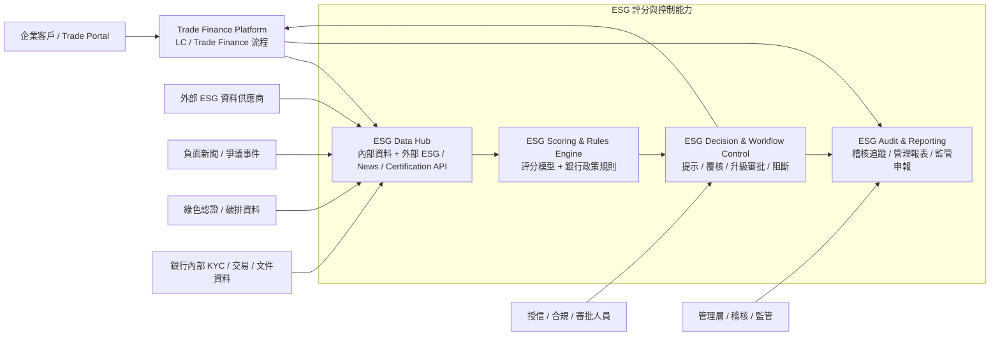
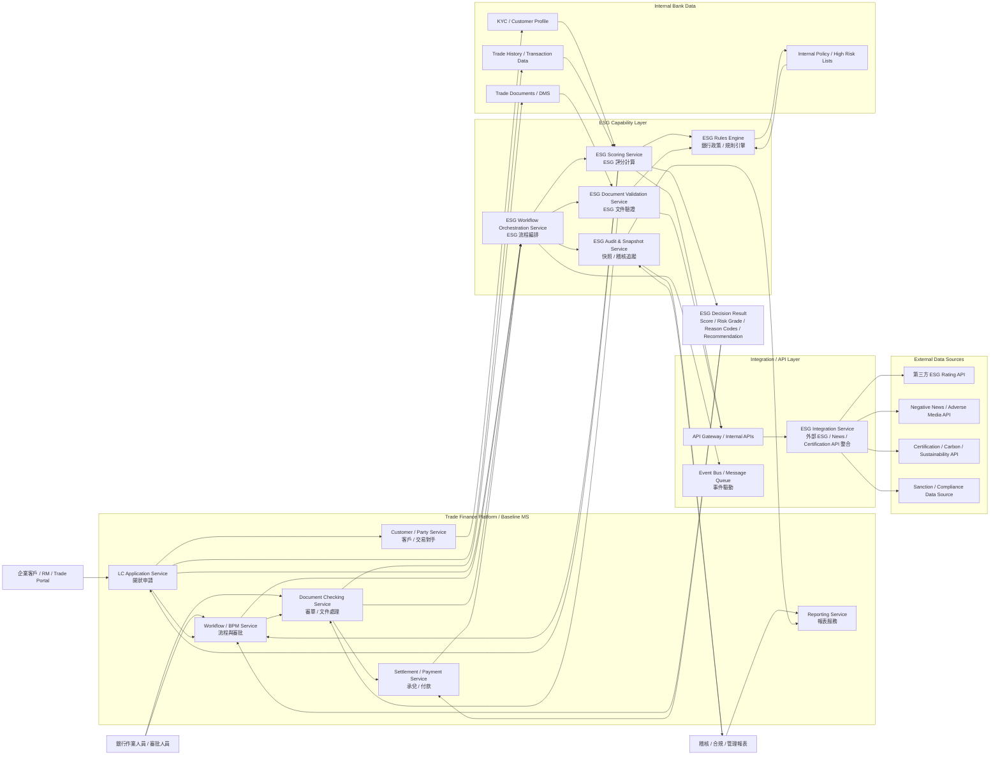

下面提供一份 **「銀行在貿易融資系統中加入 ESG 評分」的結構化方案**，以 **LC（Letter of Credit，信用狀）流程** 為主軸，採用你要求的 **一步一步分析** 方式。

---

# 一、目標與前提

## 1. 業務目標

銀行希望在貿易融資系統中導入 ESG 評分，通常有幾個目的：

1. **風險管理**
   評估申請人、受益人、買方、賣方、物流商、倉儲商、船公司等交易相關方的 ESG 風險。

2. **授信與定價差異化**
   對 ESG 表現較佳的客戶，提供較優惠的授信條件、費率或審批流程。

3. **合規與稽核**
   回應監管、內部稽核、永續金融政策、綠色金融報告需求。

4. **產品創新**
   發展 Green Trade Finance、Sustainable LC、Sustainable Supply Chain Finance 等產品。

---

# 二、一步一步分析

# 1. ESG 資料來源（內部 / 外部 API）

ESG 資料來源必須分成 **內部資料** 與 **外部資料** 兩大類，兩者結合才有實務價值。

## 1.1 內部資料來源

### A. KYC / Customer Profile

來源：

* 客戶基本資料
* 產業分類
* 國家 / 地區
* 最終受益人資料
* 關聯公司資料

用途：

* 判斷客戶是否屬於高污染、高勞工爭議、高治理風險產業
* 判斷是否位於高環境或高制裁風險地區

---

### B. 交易歷史資料

來源：

* LC 開立、修改、承兌、付款歷史
* 貿易對手資料
* 商品類別
* 交易國別
* 航線 / 港口 / 船公司資訊

用途：

* 分析客戶過往交易是否涉及高 ESG 風險商品或地區
* 建立交易行為與 ESG 風險關聯

---

### C. 文件資料

來源：

* Invoice
* Packing List
* Bill of Lading
* Certificate of Origin
* Inspection Certificate
* Insurance Document
* ESG / Carbon / Sustainability supporting documents

用途：

* 從文件中擷取商品、供應商、產地、物流方式、是否具永續認證
* 支援文件檢核與 ESG 證據比對

---

### D. 內部風控 / 黑名單 / 合規資料

來源：

* AML / Sanction screening 結果
* Negative news
* Watchlist
* High-risk industry list
* Internal ESG policy list

用途：

* 與 ESG 規則交叉比對
* 輔助形成總體風險評分

---

## 1.2 外部資料來源

### A. 第三方 ESG Rating API

例如可接入的資料類型：

* 公司 ESG Score
* Environment Score
* Social Score
* Governance Score
* Controversy / Incident Score
* Carbon Emission / Climate Risk
* Supplier sustainability data

用途：

* 取得企業級 ESG 評分
* 作為外部標準分數來源

注意：

* 不同供應商的評分模型不一樣，不能直接視為完全等價
* 需保留來源、版本、更新日期、評分解釋

---

### B. Negative News / Adverse Media API

來源類型：

* 勞工剝削
* 環境污染
* 貪腐 / 治理爭議
* 人權事件
* 制裁 / 法律訴訟

用途：

* 補足 ESG Rating 無法即時反映的事件型風險
* 用於事件驅動風險調整

---

### C. 產業與商品永續分類資料

來源類型：

* 高碳產業清單
* 禁限產業清單
* 綠色商品分類
* 可持續供應鏈認證資料

用途：

* 依產品類別或產業屬性給出初始 ESG 風險權重

---

### D. External Verification / Certification API

例如：

* 碳排證明
* 綠色認證
* 森林 / 原料來源認證
* 供應鏈責任認證

用途：

* 驗證交易是否符合綠色金融或永續金融產品定義

---

## 1.3 建議的資料整合原則

建議不要只依賴單一外部 ESG 分數，而是採用：**最終 ESG Score = 外部評分 + 內部規則 + 交易上下文 + 文件證據 + 負面事件調整**

也就是說：

* 外部 API 提供基礎分數
* 內部規則做銀行政策落地
* 文件與交易上下文提供真實業務依據
* 負面消息做動態修正

---

# 2. ESG 如何嵌入 LC 流程

ESG 不應只是報表欄位，而應嵌入 **LC 全生命週期流程**。

## 2.1 LC 流程主要節點

典型節點如下：

1. 客戶申請開狀
2. 前端資料輸入 / 上傳文件
3. KYC / Sanction / Compliance 檢查
4. 授信審批
5. 開狀
6. 修改
7. 文件提示 / 審單
8. 承兌 / 付款 / 結清
9. 報表 / 稽核 / 監管申報

---

## 2.2 ESG 嵌入點設計

## A. 申請階段（Application Stage）

在客戶提交 LC 申請時：

可檢查：

* Applicant / Beneficiary ESG Score
* 商品是否屬高風險類別
* 國別 / 航線是否高風險
* 是否涉及敏感產業

系統動作：

* 自動查 ESG API
* 自動計算初始 ESG Risk Level
* 若超過門檻，自動觸發人工覆核

---

## B. 授信 / 審批階段（Approval Stage）

將 ESG 作為審批條件之一：

可用方式：

* 作為授信決策的一個因子
* 作為 pricing 因子
* 作為 escalation 條件

例如：

* ESG 優：可加速審批或給予優惠費率
* ESG 中：正常流程
* ESG 差：需額外審批或限制產品使用

---

## C. 開狀階段（Issuance Stage）

在 LC 開立前：

系統可做：

* 將 ESG 結果寫入交易快照
* 記錄 ESG 來源與時間戳
* 若是 Sustainable LC，檢查是否有必要 supporting documents

目的：

* 確保後續稽核可追溯
* 避免開狀後 ESG 判斷被覆寫而無痕跡

---

## D. 文件審查階段（Document Checking Stage）

此階段最有價值。

系統可檢查：

* 文件中的商品、原產地、供應商資訊
* 是否與申請時 ESG 聲明一致
* 是否上傳對應 ESG supporting documents
* 是否存在 ESG 相關 discrepancy

例如：

* 申請時聲稱綠色供應商，但文件供應商不一致
* 商品類別與綠色金融申請用途不一致
* 缺少環保或來源認證文件

---

## E. 付款前控制（Pre-payment Control）

在承兌 / 付款前再次檢查：

可做：

* 再次 refresh ESG / adverse news
* 若出現重大負面事件，暫停付款或要求覆核
* 記錄付款時最終 ESG 狀態

這對風險控制很重要，因為：

* ESG 事件可能在開狀後才發生
* 銀行需避免在重大爭議爆發後仍直接放款或付款

---

## F. 報表與監管（Reporting & Audit）

系統需支援：

* ESG Trade Finance 報表
* 高風險交易統計
* 綠色交易占比分析
* 按客戶 / 國別 / 產業 / 產品的 ESG 分析
* 稽核追蹤

---

# 3. 系統架構設計（Microservices + API）

以下以微服務架構設計為主。

## 3.1 核心設計原則

1. **ESG 能力模組化**
2. **交易流程與 ESG 解耦**
3. **支持同步查詢 + 非同步重評**
4. **保留可追溯性**
5. **支援規則引擎與 API 擴充**

---

## 3.2 建議微服務拆分

## A. ESG Integration Service

職責：

* 對接外部 ESG API
* 對接 adverse news API
* 對接 certification / verification API
* 統一回傳標準資料格式

輸入：

* 公司名稱
* 統一編號 / LEI / DUNS / Registration ID
* 國別
* 產業

輸出：

* 標準化 ESG profile
* 各維度分數
* 來源供應商資訊
* 更新時間
* 信心度 / 匹配度

---

## B. ESG Scoring Service

職責：

* 整合外部評分 + 內部規則 + 交易上下文
* 產生銀行內部 ESG Risk Score / Grade

邏輯可包括：

* 外部 ESG 分數權重
* 高風險商品加權
* 高風險國家加權
* 文件缺漏扣分
* 負面消息降級

輸出：

* ESG Total Score
* Risk Grade
* Reason Codes
* Recommendation

---

## C. ESG Rules Engine

職責：

* 實現銀行政策規則
* 維護可配置門檻與條件

規則示例：

* 若商品屬煤炭且國別高風險，則 ESG = High Risk
* 若為 Sustainable LC 且缺少認證文件，則不允許自動放行
* 若 Governance score 低於門檻，則需第二級審批

建議：

* 規則外部化，不要硬寫在 LC 核心程式碼裡

---

## D. ESG Document Validation Service

職責：

* 從貿易文件抽取 ESG 相關資料
* 比對申請資料與文件內容
* 驗證 supporting documents 是否完整

可搭配：

* OCR / Vision LLM / Document AI
* 文件分類
* 欄位抽取
* 規則比對

---

## E. ESG Workflow Orchestration Service

職責：

* 依不同流程節點觸發 ESG 檢查
* 與 LC Workflow / BPM / Case Management 整合
* 發送人工覆核任務

---

## F. ESG Audit & Reporting Service

職責：

* 保存每次 ESG 查詢、計算、決策快照
* 提供報表、查詢、監管輸出
* 支援稽核追蹤

---

## 3.3 與既有 Trade Finance 微服務的整合方式

建議 ESG 作為橫向能力，與以下服務整合：

* Customer / Party Service
* LC Application Service
* Compliance Service
* Document Checking Service
* Approval Workflow Service
* Pricing Service
* Reporting Service

---

## 3.4 API 設計概念

### 1. Party ESG Query API

```text
POST /esg/party-assessment
```

輸入：

* partyId
* partyName
* country
* industry
* identifiers

輸出：

* external scores
* internal normalized score
* risk level
* reasons

---

### 2. Transaction ESG Assessment API

```text
POST /esg/transaction-assessment
```

輸入：

* transactionId
* applicant
* beneficiary
* goods
* countries
* shipping info
* product type

輸出：

* transaction ESG score
* alerts
* approval recommendation

---

### 3. Document ESG Validation API

```text
POST /esg/document-validation
```

輸入：

* transactionId
* documentSet
* extracted data

輸出：

* document ESG consistency result
* missing supporting docs
* discrepancy list

---

### 4. ESG Decision Snapshot API

```text
POST /esg/snapshot
GET /esg/snapshot/{transactionId}
```

用途：

* 保存每一階段 ESG 判斷結果
* 支援稽核與回溯

---

## 3.5 事件驅動設計建議

建議重要節點用事件驅動：

* LC_APPLICATION_SUBMITTED
* ESG_CHECK_REQUESTED
* ESG_SCORE_COMPLETED
* ESG_ALERT_RAISED
* DOCUMENTS_PRESENTED
* ESG_DOCUMENT_VALIDATION_COMPLETED
* PAYMENT_READY
* ESG_RECHECK_COMPLETED

優點：

* 易擴展
* 易整合多個子系統
* 適合未來接 AI Agent / rule engine / compliance engine

---

## 3.6 建議資料模型欄位

交易層至少應保存：

* transaction_id
* applicant_id
* beneficiary_id
* supplier_id
* goods_category
* origin_country
* destination_country
* external_esg_score
* internal_esg_score
* esg_risk_level
* environment_score
* social_score
* governance_score
* controversy_flag
* adverse_news_flag
* supporting_doc_status
* assessment_timestamp
* assessment_source
* decision_code
* reviewer_id
* review_comments

---

# 4. 風險與合規考量

導入 ESG 評分，不能只看技術，必須同步考慮風險與合規。

## 4.1 模型風險

問題：

* 外部 ESG 評分標準不一致
* 評分可能落後於真實事件
* 不同供應商之間分數差異大

控制措施：

* 保留資料來源與版本
* 建立 internal normalization
* 不讓單一分數直接決定生殺大權
* 加入人工覆核機制

---

## 4.2 資料品質風險

問題：

* 公司名稱匹配錯誤
* 關聯企業識別錯誤
* 文件抽取不準
* API 資料缺漏或延遲

控制措施：

* 建立 entity resolution
* 保留 match confidence
* 低信心資料需人工確認
* 對關鍵欄位設置 mandatory review

---

## 4.3 法規與隱私風險

問題：

* 第三方資料使用授權限制
* 跨境資料傳輸要求
* 個資 / 商業敏感資料保護

控制措施：

* 僅傳最少必要資料給外部 API
* 資料脫敏與加密
* API 存取審計
* 合約上明確規範資料用途與保存期限

---

## 4.4 業務風險

問題：

* ESG 規則太嚴，造成業務阻塞
* ESG 規則太鬆，無法有效控風
* 一線業務不了解 ESG 結果含義

控制措施：

* 分級管理：提示、警示、阻斷
* 分階段上線：先看板，再半自動，再正式控管
* 提供 reason code 與 explainable output

---

## 4.5 合規與稽核風險

問題：

* 無法說明為什麼某筆交易被放行或被拒絕
* ESG 判斷缺乏追溯性

控制措施：

* 保存 ESG decision snapshot
* 記錄規則版本、API 回應、人工覆核紀錄
* 提供 audit trail

---

## 4.6 漂綠（Greenwashing）風險

問題：

* 客戶聲稱交易為綠色，但實際文件與供應鏈不支持
* ESG supporting documents 為形式上存在，實質無法驗證

控制措施：

* 文件驗證
* 外部認證交叉檢查
* 規則要求 supporting evidence
* 高風險產品需人工審查

---

# 三、最終結構化方案

# 方案名稱 **Trade Finance ESG Scoring Framework for LC**

---

## A. 業務流程方案

### 第 1 階段：申請前 / 申請時

* 查詢 Applicant / Beneficiary / Supplier ESG 資訊
* 對商品、國別、產業做初步風險分類
* 產生初始 ESG Risk Score

### 第 2 階段：授信與審批

* 將 ESG Score 納入授信與開狀審批條件
* 依不同門檻決定：

  * 自動通過
  * 人工覆核
  * 升級審批
  * 限制或拒絕

### 第 3 階段：開狀與修改

* 將 ESG 結果與來源保存為交易快照
* 對 Sustainable LC 要求必要 supporting documents

### 第 4 階段：文件審查

* 從文件中抽取 ESG 相關資訊
* 與申請資料及聲明比對
* 發現 ESG discrepancy 時觸發例外流程

### 第 5 階段：付款前重評

* 在重大節點重新查 ESG / adverse news
* 若有重大爭議事件，暫停付款並人工覆核

### 第 6 階段：報表與稽核

* 支援 ESG 交易統計、綠色金融報表、稽核追蹤

---

## B. 技術架構方案

### 核心服務

1. **ESG Integration Service**
   對接外部 ESG / news / certification APIs

2. **ESG Scoring Service**
   計算銀行內部 ESG 總分與風險等級

3. **ESG Rules Engine**
   管理銀行 ESG 政策與決策規則

4. **ESG Document Validation Service**
   驗證文件與 ESG supporting evidence

5. **ESG Workflow Orchestration Service**
   與 LC 流程整合，控制自動化與人工覆核

6. **ESG Audit & Reporting Service**
   提供 audit trail、報表與監管輸出

---

## C. 決策機制方案

### ESG 決策輸出建議

每次評分至少輸出：

* ESG Total Score
* Risk Grade
* Alert Level
* Reason Codes
* Recommended Action
* Source & Timestamp
* Reviewer Requirement

### 決策等級

* **Low Risk**：可直通
* **Medium Risk**：警示 + 覆核
* **High Risk**：升級審批
* **Critical Risk**：阻斷或暫停

---

## D. 合規與治理方案

1. 保留所有 ESG 判斷快照
2. 規則版本化
3. 第三方 API 結果留痕
4. 支援人工覆核與 override
5. 對外部數據做來源管理與授權控制
6. 避免將 ESG 當成黑盒分數直接決策

---

# 四、建議的落地路線圖

## Phase 1：看板與提示

* 先接入外部 ESG API
* 在客戶與交易畫面顯示 ESG Score
* 不阻斷流程，只提供提示與報表

## Phase 2：半自動控制

* 將 ESG 納入審批規則
* 高風險時觸發人工覆核
* 開始保存 decision snapshot

## Phase 3：文件與付款前重評

* 將 ESG 驗證擴展到 document checking
* 在付款前做再評估
* 建立例外處理流程

## Phase 4：永續金融產品化

* 支援 Sustainable LC / Green Trade Finance
* 連動定價、授信、客戶分群與監管報表

---

# 五、最終結論

**最可行的做法，不是把 ESG 當成一個靜態欄位，而是把它做成一個橫向能力平台，嵌入 LC 全流程。**

核心思路是：

* **外部 API 提供標準化評分**
* **內部規則提供銀行政策落地**
* **文件與交易上下文提供真實證據**
* **微服務架構提供擴展性與可維護性**
* **稽核快照與人工覆核提供合規性與可解釋性**

這樣才能真正讓 ESG 在 Trade Finance 裡變成：
**可用、可控、可審、可擴展** 的能力。

如果你要，我下一步可以直接幫你補成 **三個版本** 之一：

1. **Mermaid 架構圖**
2. **Baseline MS 模組設計稿**
3. **PPT 簡報版高層摘要**

## Top Manager Mermaid 架構圖版本



## Advanced Architecture Version



```md
ESG 不是「先算一次 KYC 分數就好」，而是：
👉 **「靜態評分 + 動態監控 + 交易上下文評估」三者結合**

我幫你整理成銀行可落地的思路👇

---

# 🧠 一、正確觀念（關鍵）

不是單一流程，而是 **三層 ESG 評估模型**：

## 1️⃣ 靜態 ESG（KYC-based）

👉 以「客戶本身」為核心

來源：

* KYC / 客戶資料
* 外部 ESG Rating
* 產業 / 國別風險
* 負面新聞

輸出：

* **Baseline ESG Score（基礎分數）**

📌 特點：

* 更新頻率低（每日 / 每週）
* 用於「客戶風險輪廓」

---

## 2️⃣ 動態 ESG（Event-based）

👉 持續監控「變化」

來源：

* 負面新聞（污染、勞工問題、貪腐）
* 制裁變化
* ESG rating 更新
* 重大事件（事故、罰款）

輸出：

* **ESG Alert / Re-rating**

📌 特點：

* 即時或準即時
* 會影響「已存在交易」

---

## 3️⃣ 交易 ESG（Transaction-based）⭐最重要

👉 每一筆 LC / Trade 都要重新評估

來源：

* 商品（煤炭 vs 綠能）
* 供應鏈（supplier ESG）
* 國別 / 航線
* 文件內容（是否有 ESG supporting docs）

輸出：

* **Transaction ESG Score（交易級分數）**

📌 特點：

* 每筆交易不同
* 是真正「決策用」

---

# 🔁 二、完整 ESG 評估流程（你可以這樣講給管理層）

```text
Step 1：KYC ESG（客戶基礎分數）
Step 2：交易 ESG（結合商品 / 文件 / 供應鏈）
Step 3：動態 ESG（事件監控與調整）
Step 4：最終決策（授信 / 審批 / 放行）
```

---

# 🎯 三、用一句話講清楚（高層版）

👉 **ESG = 客戶風險 + 交易風險 + 即時事件風險**

---

# 🧩 四、舉例（非常重要）

## 案例 1：好客戶 + 壞交易

* 客戶 ESG：高（良好公司）
* 交易商品：煤炭
* 國別：高污染國家

👉 結果：
❌ Transaction ESG = 高風險
👉 需覆核 / 限制

---

## 案例 2：普通客戶 + 綠色交易

* 客戶 ESG：中
* 商品：太陽能設備
* 有綠色認證

👉 結果：
✅ Transaction ESG = 可提升
👉 可給優惠或快速通關

---

## 案例 3：交易後出事（最關鍵）

* 開狀時 ESG 正常
* 付款前出現：

  * 勞工剝削新聞
  * 環境污染事件

👉 結果：
⚠️ Trigger ESG Re-check
👉 暫停付款 / 人工覆核

---

# 🏗 五、系統設計上的對應（你架構圖那套）

對應你剛剛的架構：

| 層級              | 對應服務                       |
| --------------- | -------------------------- |
| KYC ESG         | ESG Integration + Scoring  |
| Transaction ESG | ESG Scoring + Rules Engine |
| Dynamic ESG     | Event Bus + Re-evaluation  |
| 決策              | Workflow / Approval        |

---

# ⚠️ 六、常見錯誤（很重要）

很多銀行會做錯👇

❌ 只做：

* 「客戶 ESG Score 一次算完」

👉 問題：

* 無法反映交易差異
* 無法應對突發事件
* 無法支持綠色金融產品

---

# ✅ 正確做法（你可以拿去做方案）

👉 必須三層一起做：

1. **Customer ESG（KYC）**
2. **Transaction ESG（每筆交易）**
3. **Dynamic ESG（事件驅動）**

---

# 🚀 七、進階（你可以用來做 AI Agent）

你現在在做 Agentic AI，很適合加這個：

👉 ESG Agent 分工：

* Agent 1：ESG Data Collector（API + KYC）
* Agent 2：Transaction Analyzer（商品 / 文件）
* Agent 3：Risk Evaluator（Rules + Scoring）
* Agent 4：Monitoring Agent（News / Event）
* Agent 5：Decision Agent（Workflow）

---

# 🎯 最終結論

👉 你說的是「第一步」，但完整應該是：

> **先建立 KYC ESG 基礎分數，
> 再針對每一筆交易做 ESG 評估，
> 並透過事件監控持續動態調整。**

---

如果你要，我可以幫你做下一步（很關鍵）👇

👉 **「ESG Scoring 模型（公式 + 權重 + 規則）」設計稿（銀行可落地版）**

---
